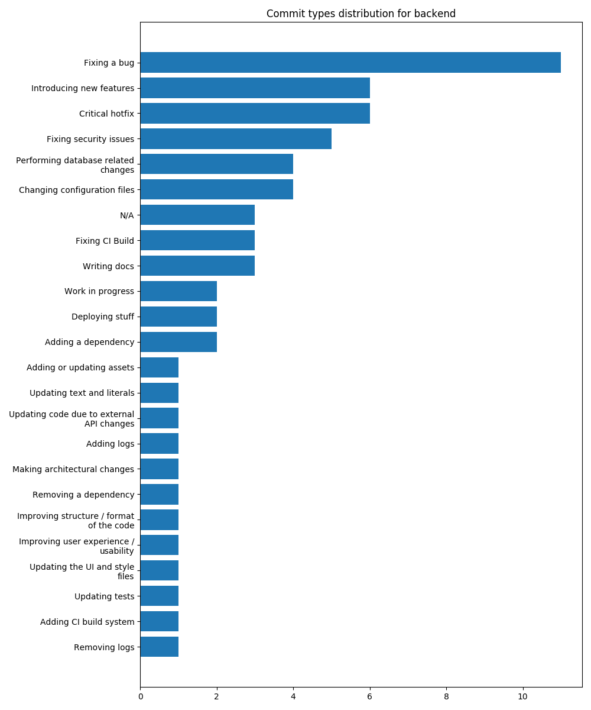

<h1 align="center"> <br>Backend API   </h1> </center>

## What is schoolsyst?

If you don't know, you should head over to [the main repository](http://git.schoolsyst.com/frontend), where all feature requests & bug reports are posted.
This one is strictly about the *API* schoolsyst's frontend webapp uses.

For now, this API is closed and can only be used from `*.schoolsyst.com` domains, as the only thing running all of schoolsyst is a tiny VPS.

## Great, I came from the main repo because I want to run the backend locally. How?

1. Clone the repository

```sh-session
git clone http://git.schoolsyst.com/backend
```

2. Install the dependencies

```sh-session
poetry install
```

3. Activate the virtual environment

Alternatively, you can prefix commands with `poetry run` (see `poetry help run`)

```sh-session
poetry shell
```

4. Run the migrations

```sh-session
python3 manage.py migrate
```

5. Serve the server on port 9999

```sh-session
python3 manage.py runserver 9999
```

## API Documentation

What the API describes is what I aim to release as `v1.0.0`. A lot of things differ from the API's current state. Still, you can read it right now [here](docs/index.md)

## Commit types distribution



(generated by [`commit-types-distribution`](https://github.com/ewen-lbh/gitmoji-commits-graphs))
